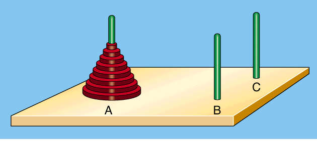

# 递归算法

## 何为递归

>   To iterate is human,to recurse divine. --L.Peter Deutsch

**L.Peter Deutsch** 曾说过这么一句话，翻译成中文则是：

>   重复迭代是人类的能力，而递归则是神灵的能力。

上面这句话听起来有点玄乎，还是让我们使用Coding的思路，来重新给 **递归 ** 和 **迭代** 下个定义：

!> 递归是一种在函数内部调用自己的方式，它使程序简洁、可读性强，但是需要注意递归深度，防止堆栈溢出。

!> 迭代则是一种基于循环的方法，相比递归更容易理解和掌握，但在某些问题上可能会更加复杂。

## 递归的特征

递归需要满足两个条件：

*   **基本结束条件**：需要定义一个基本结束条件，即递归的终止条件。**如果没有终止条件，递归将永远执行，直到程序栈溢出。**
*   **递归调用：**需要调用自身，但是每次调用时都要使得问题规模更小，以实现最终收敛到基本结束条件的状态。

由上面两个特征表述，可以看出：

!> 递归通常用于解决问题的分治思想，将大的问题分解成小的子问题，然后逐层递归解决子问题，最终合并子问题的结果得到最终解决方案。

## 递归思想的应用

**汉诺塔**，相信很多朋友都玩过，这是源于印度的一个古老传说的益智游戏。

>   相传大梵天创造世界的时候做了三根金刚石柱子，在一根柱子上从下往上按照大小顺序摞着64片黄金圆盘。 大梵天命令婆罗门把圆盘从下面开始按大小顺序重新摆放在另一根柱子上。并且规定，在小圆盘上不能放大圆盘，在三根柱子之间一次只能移动一个圆盘。



如上图所示，现在我们的目标是：**将A柱上的圆盘移动到B柱上去**。

我们将按照下面的思路一步步进行：

1.   假设 **A** 柱上有 **1** 个圆盘，那我们直接 **A -> B** 即可完成；

2.   假设 **A** 柱上有 **2** 个圆盘，这时要借助C来完成；当我们把第一个圆盘从 **A -> C** 后，**A** 柱只剩一个，既可以采用步骤1的操作来完成即 **A -> B**，此时 **A** 柱没有圆盘， **B** 柱上有最大的圆盘(意味着任何圆盘都可以直接放上面，相当于没有)，**C** 柱有一个圆盘，如果我们把 **C** 柱看作是 **A** 柱，会发现也可以采用步骤1的操作来完成，**A(实际是C) -> B**。总结一下 **A** 柱有2个圆盘时的操作如下：

     ```bash
     第一步：A -> C
     第二步：A -> B
     第三步：C -> B
     ```

3.   继续假设 A 柱上有3个圆盘，接下来要划重点了，因为递归的思想在这一步可以非常好的表达。A 柱有3个圆盘，我们想要把这三个圆盘移动到 B 柱之上，首先要把前两个小号的圆盘转移到 C 柱之上，然后把最大的移动到 B，再把 C 柱上的移动到 B 柱即可。

     ```bash
     第一步：A -> C (2个圆盘)
     第二步：A -> B (1个最大的圆盘)
     第三步：C -> B (2个圆盘)
     ```

     很明显，我们打破了规则，因为不能同时移动两个圆盘。所以，第一步和第三步必须进行拆解。这时可以发现，将两个圆盘从一个柱子移动到另一个柱子去的步骤我们已经分析过了，直接执行步骤2即可，第三步也是如此，因此有：

     ```bash
     第一步：A -> C (2个圆盘) 使用步骤2的思路，将C柱当做B柱，B柱当做C柱，套用步骤可得：
       - 1. A -> B
       - 2. A -> C
       - 3. B -> C
     第二步：A -> B (1个最大的圆盘)
     第三步：C -> B (2个圆盘) 使用步骤2的思路，将C柱当做A柱，A柱当做C柱，套用步骤可得：
       - 1. C -> A
       - 2. C -> B
       - 3. A -> B
     ```

?> 道家说：“道生一，一生二，二生三，三生万物”。

掌握了3个圆盘的移动过程，4个、5个乃至100个都万变不离其宗！


## 代码实现

请允许我使用**Python**来做代码的实现**:frog:**

```python
# Hanio tower python script
def move(a, b, c, number):
    if number == 1:
        print(f'{a} -> {b}')
    else:
        move(a, c, b, number - 1)
        move(a, b, c, 1)
        move(c, b, a, number - 1)

if __name__ == '__main__':
    move('A', 'B', 'C', 4)
```

这里我们还是指定，需要将4个圆盘从 A 柱移动到 B 柱，结果输出如下：

```bash
A -> C
A -> B
C -> B
A -> C
B -> A
B -> C
A -> C
A -> B
C -> B
C -> A
B -> A
C -> B
A -> C
A -> B
C -> B
```

有没有理论上没问题，一动手就懵逼的小可爱？:blush: