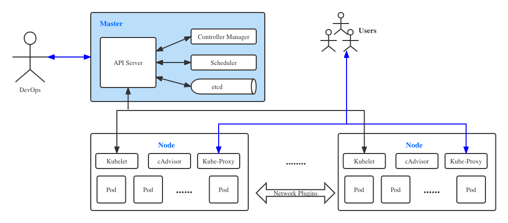

# sK8S架构设计
## 简介

Kubernetes最初源于谷歌内部的Borg，提供了面向应用的容器集群部署和管理。

Kubernetes 的目标旨在消除编排物理/虚拟计算，网络和存储基础设施的负担，并使应用程序运营商和开发人员完全将重点放在以容器为中心的原语上进行自助运营。

Kubernetes 具备完善的集群管理能力，包括多层次的**安全防护**和**准入机制**、**多租户应用支撑能力**、透明的**服务注册**和**服务发现**机制、内建**负载均衡**器、**故障发现**和**自我修复**能力、**服务滚动升级**和**在线扩容**、可扩展的资源自动调度机制、多粒度的资源配额管理能力。

## 架构设计

## 核心组件

* API Server：所有服务访问统一入口。对外暴露K8S的api接口，是外界进行资源操作的唯一入口，并提供认证、授权、访问控制、API注册和发现等机制。
* Controller Manager：负责资源的调度，按照预定的调度策略将Pod调度到相应的机器上。比如Pod调度：监视新创建的 Pod，如果没有分配节点，就选择一个节点供他们运行
* ETCD：分布式键值存储服务，能够为整个分布式集群存储一些关键数据，协助分布式集群运转。支持持久化，宕机可恢复。
* Kubelet：直接跟容器引擎(比如DockerEngine)交互实现容器的生命周期管理。
* Kube-Proxy：提供统一访问接口、提供有4层负载均衡、服务发现等功能

## 推荐组件

* Kube-dns：为集群提供DNS服务
* Ingress Controller：为服务提供外网入口
* Heapster：提供资源监控
* Dashboard：GUI管理
* Fluentd-elasticsearch：日志采集、存储与查询（docker原生支持Fluentd，故不使用logstash）